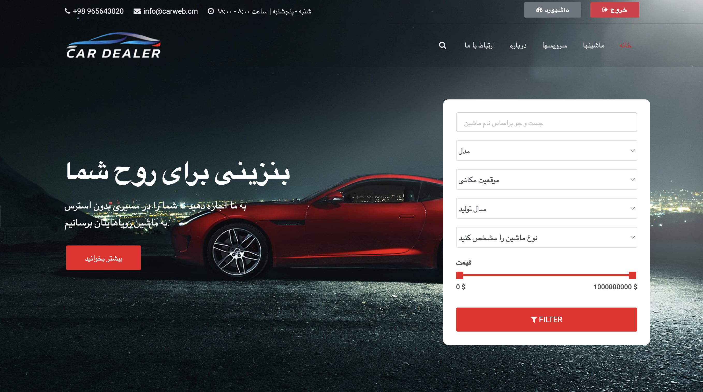

# Project Repository
https://github.com/Ali-M-Tabatabaei/online-car-store

# Project Description
- an online car dealership website
- created using purely django
- no frontend framework used
- site functionality:
    - users can view each other's listed cars
    - users can put their own cars for sale

# Test Divisions
- signin/signup: سمیه قربانی مقدم (۹۹۱۲۷۶۲۰۸۵)
- responsiveness: سید علی موسوی (۹۹۱۲۰۹۷)
- car search: سعید طالبی زاده (۹۹۱۲۷۶۲۷۲۳)
- dashboard: رضا فرخ (۹۹۱۲۷۶۲۶۷۶)
- site navigation: علی وزیری نژاد (۹۹۱۲۷۶۲۴۹۴)

## signin/signup tests (SomayehGhorbaniMoghaddam_9912762085)
- **EmptyFieldsTest** (Empty Fields Test)  
  This test checks whether the system displays an appropriate error message when a user tries to submit the login or signup form without entering any information.  

- **InvalidEmailTest** (Invalid Email Test)  
  This test verifies whether the system correctly detects and rejects an invalid email address (e.g., missing `@` or an incomplete domain) and displays an appropriate error message.  

- **ShowPassIconTest** (Show/Hide Password Test)  
  This test checks if the "Show/Hide Password" button in the login or signup form functions correctly by toggling the password visibility from hidden (`•••••`) to visible text.  

- **SignOutSignInTest** (Sign Out and Sign In Test)  
  This test verifies whether a user can successfully log out (`Sign Out`) and then log back into their account without any issues.  

- **SignupTest** (Signup Test)  
  This test ensures that a new user can complete the signup process successfully and is redirected to the appropriate page after registration.  

- **WrongPasswordTest** (Wrong Password Test)  
  This test checks whether the system correctly handles login attempts with a valid email but an incorrect password by displaying an appropriate error message.  

## responsiveness tests (SeyedAliMousavi_9912097)
- Viewport Resizing Test:
     - Ensures the website adapts correctly to different screen sizes, including desktop, tablet, and mobile. The test resizes the browser window and verifies that the layout remains intact without breaking.

- Mobile View Test:
     - Simulates a mobile device using browser emulation to check if the mobile-specific layout, styles, and functionalities (e.g., responsive menus) are properly applied.

- Hamburger Menu Test:
     - Verifies that the hamburger menu appears in mobile view and expands when clicked. It also ensures that menu items are displayed correctly and can be interacted with.

- Responsive Images Test:
     - Checks whether images scale properly across different screen sizes without exceeding their container width. This prevents layout issues and unnecessary horizontal scrolling.

- Tablet Layout Test:
     - Ensures that the website layout remains properly structured when viewed on a tablet. It verifies the correct positioning of key elements and prevents layout shifts.

- Horizontal Scroll Test:
     - Detects unnecessary horizontal scrolling in small screen sizes. It checks if the content width exceeds the viewport width, which could indicate layout problems.

## car search tests (SaeedTalebizadeh_9912762723)
- test_search_car_asd:
    - Tests searching for a car with the keyword "asd". It verifies that one car is found.
- test_search_car_lamborgini:
    - Tests searching for a car with the keyword "lamborgini". It verifies that one car is found.
- test_search_car_by_model:
    - Tests searching for a car by selecting the model "r8" from a dropdown. It verifies that no cars are found.
- test_search_car_by_price: 
    - Tests searching for cars within a specified price range by adjusting price sliders. It verifies that no cars are found within the specified range.
- test_price_slider_lower_boundary: 
    - Tests the lower boundary of the price slider to ensure it increases when moved.
- test_price_slider_upper_boundary: 
    - Tests the upper boundary of the price slider to ensure it decreases when moved.
- test_search_car_by_city: 
    - Tests searching for cars in the city "Mashhad". It verifies that no cars are found.
- test_price_slider_lower_not_exceed_upper: 
    - Tests that the lower price boundary does not exceed the upper boundary.
- test_search_car_by_year: 
    - Tests searching for cars from the year "2020". It verifies that no cars are found.
- test_search_car_by_body_style: 
    - Tests searching for cars with the body style "racing". It verifies that no cars are found.

## dashboard tests (RezaFarokh_9912762676)
- test_login
    - login before going to dashboard (pass)
- test_add_car
    - test for funtion of this session (pass)
- test_delete_car
    - test for can we delete a car or not (pass)
- test_shopping_cart
    - test that we are able to complete or not (fail)
- test_about_button
    - test about button from this page work or not (pass)
- test_question_session
    -  that we can redirect to car page or not (fail)
- video of test:
    - RezaFarokh_9912762676/output.mp4

## site navigation tests (AliVazirinejad_9912762494)
- navbar_home_test:
    - tests whether the 'خانه' link in navbar redirects to the home page
- navbar_cars_test:
    - tests whether the 'ماشینها' link in the navbar redirects to the cars page
- navbar_services_test:
    - tests whether the 'سرویس ها' link in the navbar redirects to the services page
- navbar_about_test:
    - tests whehter the 'درباره' link in the navbar redirects to the about page
- navbar_contact_test:
    - tests whether the 'ارتباط با ما' link in the navbar redirects to the contact page
- car_test:
    - tests whether the sample car link in the car page, redirects to that very car's specifications page 
- car_send_message_test:
    - tests whether the 'ارسال پیام' modal in the car specification pop up when clicking on the 'ارسال پیام' button
- dashboard_not_logged_in_test:
    - tests whether clicking on the 'داشبورد' button on the navbar redirects to the login page when the user is not logged in
- demo:
    - a short video displaying the tests in execution
